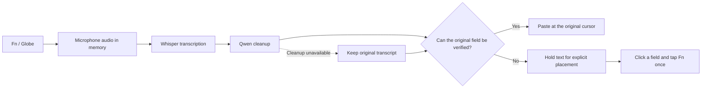

<p align="center">
  
</p>

<h1 align="center">I'm not paying for Wispr Flow.</h1>
<p align="center"><strong>Local voice dictation for your Mac. Free to use. Yours to build on.</strong></p>
<p align="center">
  <a href="https://github.com/ysham123/imnotpayingforwisprflow/releases/latest"></a>
  
  
  <a href="LICENSE"></a>
</p>
<p align="center">
  <a href="https://github.com/ysham123/imnotpayingforwisprflow/releases/latest/download/Local-Dictation-Installer.zip"><strong>Download for Mac</strong></a>
  &nbsp;·&nbsp; <a href="#get-started">Get started</a>
  &nbsp;·&nbsp; <a href="#what-runs-under-the-hood">How it works</a>
  &nbsp;·&nbsp; <a href="docs/DEVELOPMENT.md">Build from source</a>
</p>

**Click a text box. Double-tap Fn / Globe. Speak. Tap Fn once to finish.**

Local Dictation is a native menu-bar app that turns speech into text, removes fillers and accidental repetition, and resolves clear spoken corrections before inserting the result. Speech recognition and cleanup run on your Mac. The download includes both models and their runtime.

No subscription, API key, account, or separate Ollama installation is required. No recordings or transcript history are saved.

```text
You say:  “Let's meet on Thursday, sorry, Friday at three.”
You get:  “Let's meet on Friday at three.”
```

That example passes the local model checks. Ambiguous speech, names, and numbers can still need editing.

## Get started

### 1. Install

[**Download the installer ZIP**](https://github.com/ysham123/imnotpayingforwisprflow/releases/latest/download/Local-Dictation-Installer.zip), unzip it, and double-click **Install Local Dictation.command**. It opens in Terminal and installs the app into your personal **Applications** folder (`~/Applications`). You can inspect the [installer source](Distribution/install.sh) before running it.

The installer downloads about **3.4 GB**, verifies the release parts against their SHA-256 hashes, checks the app signature, and then installs it. Keep **10 GB of disk space free** during installation. GitHub limits individual release assets to 2 GiB, so the app ships in two parts; the installer handles them for you.

| Requirement | Supported release |
|---|---|
| Mac | Apple Silicon, M1 or newer |
| macOS | 14 Sonoma or newer |
| Language | English |
| Memory | Tested with 16 GB; 16 GB recommended |
| Network | Needed to download; dictation runs locally afterward |
| Developer tools | None needed for the installer |

> **Community release:** the app is ad-hoc signed and is not notarized by Apple. If macOS blocks it, try opening it, then follow **System Settings → Privacy & Security → Open Anyway** if you choose to trust this build. See [Apple's guidance](https://support.apple.com/en-us/102445). The installer does not disable Gatekeeper or remove quarantine attributes.

<details>
<summary>Prefer Terminal, or need an offline installation?</summary>

Download the installer from the pinned release, then run it:

```bash
curl --fail --location \
  https://github.com/ysham123/imnotpayingforwisprflow/releases/download/v1.1.1/install.sh \
  --output /tmp/local-dictation-install.sh

# Optional: inspect the script before running it.
less /tmp/local-dictation-install.sh
bash /tmp/local-dictation-install.sh
```

For an offline installation, download `install.sh` and **both** `.tar.part…` files from the same release onto the target Mac. Then run:

```bash
bash install.sh --assets-dir /path/to/downloaded-release-files
```

For an existing app in `/Applications`, quit it and use:

```bash
bash /tmp/local-dictation-install.sh --destination /Applications --replace
```

The installer refuses to overwrite an existing app unless `--replace` is supplied. It stages and verifies the new copy before replacing the old one, and restores the old copy if final verification fails. The destination must be writable by your user; do not run the installer with `sudo`.

</details>

### 2. Grant three permissions

Open **Local Dictation.app**, then choose **Setup…** from its microphone menu in the macOS menu bar.

| Permission | Why it is needed |
|---|---|
| **Microphone** | Capture audio while you dictate |
| **Accessibility** | Identify your text field and insert the result |
| **Input Monitoring** | Recognize the Fn / Globe shortcut across apps |

Enable **Local Dictation itself** in each permission list. If macOS asks you to quit and reopen it, do so.

### 3. Free up the Fn / Globe key

In **System Settings → Keyboard**:

- Set **Press 🌐 key to** to **Do Nothing**.
- Make sure Apple's built-in Dictation shortcut does not use Fn / Globe.
- Quit other dictation apps using that key, including Wispr Flow.

Local Dictation does not change these settings automatically.

### 4. Dictate

1. Wait until the microphone menu says **Ready · double-tap Fn**, then click the text box where you want your words. Models can take a moment to load on first use.
2. **Double-tap Fn / Globe** to start. A small floating indicator shows **Listening** and microphone activity.
3. Speak naturally, including corrections such as “Thursday, sorry, Friday.”
4. **Tap Fn once** to finish. Wait for transcription and cleanup, then check the text.

If you click away or move the cursor, the indicator shows **Text ready**. Click the intended text box and **tap Fn once** to place your words. A short pause distinguishes this single tap from a double-tap. You can also choose **Copy** or **Discard**. Resolve waiting text before starting another dictation; a double-tap will remind you instead of overwriting it.

<p align="center">
  
</p>

**Paste sent** means the app sent one paste but could not confirm the editor's update. Check the field before using **Copy last result**. It never automatically pastes the same result twice.

Double-tapping to finish also stops once. Use short taps rather than holding the key. The app never presses Return or sends a message for you.

## What runs under the hood



| Component | Job |
|---|---|
| **Swift + AppKit** | Native menu-bar app, floating indicator, setup, and placement recovery |
| **AVFoundation** | Capture microphone audio and convert it to 16 kHz mono in memory |
| **whisper.cpp 1.8.3** | Run speech recognition locally with Metal acceleration |
| **Whisper large-v3-turbo, Q8_0** | English speech-to-text model, about 874 MB |
| **Ollama 0.9.6** | Bundled local correction runtime on loopback port `11437` |
| **Qwen3 4B, Q4_K_M** | Clean fillers, repetition, false starts, and explicit self-corrections; about 2.5 GB |
| **macOS Accessibility + clipboard** | Check the destination and deliver text while preserving clipboard contents where possible |

Cleanup is conservative. Validation rejects reordered content, reassigned numbers, unfamiliar identifiers, and dropped or moved negation. If correction fails, times out, or changes too much, the app uses the original transcript. These checks reduce errors; they cannot prove that every sentence preserves its intended meaning.

## Privacy and control

- **Audio stays in memory.** Normal dictation does not write recording files.
- **No transcript history.** One waiting result is protected until you insert, copy, or discard it. A copy backup of the last dispatched result remains until replaced or the app exits. Starting or canceling another recording does not erase that backup.
- **Local inference.** Audio and text are processed by bundled models on your Mac; there is no cloud transcription fallback.
- **Temporary clipboard use.** Auto-paste stages the result and restores the previous clipboard if nothing else has copied in the meantime. Some applications' promised/lazy clipboard formats may not restore exactly.
- **Local performance measurements.** The last 100 session timings stay in memory. Export them explicitly from the microphone menu; they contain no audio, transcript, or application names.
- **Your destination still matters.** Once text is inserted into another app, that app's own storage and privacy behavior applies.

The menu includes **Cancel dictation**, **Copy last result**, **Discard waiting text**, **Retry local engines**, and **Export performance measurements**. Copy last result intentionally replaces the clipboard.

## Compatibility and troubleshooting

| What you see | What to do |
|---|---|
| Fn does nothing | Open Setup, check all three permissions, and remove competing Fn shortcuts. |
| Fn does nothing on an external keyboard | Try the Mac's built-in Fn / Globe key. Some third-party keyboards handle Fn internally and do not send an event macOS can detect. |
| Permissions look enabled, but Setup says “needed” | Quit the app. In Privacy & Security, toggle Local Dictation off and back on, then reopen. If a stale Accessibility entry persists, remove it and add the current app again. |
| Text ready | Click the intended text box and tap Fn once. If the field cannot be verified, choose **Copy** and paste manually. |
| The cursor or text field changed | Your text waits. Select its destination and tap Fn once, or copy/discard it. |
| “Paste sent” | Check the field before pasting again. The app could not confirm the result and does not retry automatically. |
| Correction is unavailable | Dictation can use the raw transcript. Use **Retry local engines** to retry correction startup. |
| Microphone changed or recording stopped | Captured speech is retained when possible and processed; the status explains the interruption. |
| Installation is interrupted | Rerun the installer. Partial downloads in its versioned cache can resume. |
| Signature verification reports “resource fork” or Finder metadata | Install into the default local Applications folder. iCloud or other synced destinations can add metadata that invalidates the bundle. |

The creator has confirmed the Fn workflow in Google search and, with version 1.1.1, in both Claude and ChatGPT desktop text boxes. The v1.2 candidate passes insertion checks across native AppKit, WKWebView, and Electron fixtures, including rich editors, delayed clipboard reads, and protected controls. Compatibility varies by app and editor; see the [validation record](docs/VALIDATION.md) for tested versions and limits. Opaque fields keep text waiting; Copy remains available when explicit placement cannot verify them. Terminal panes are not validated, and multiline terminal paste can execute commands depending on terminal settings.

Rich editors can update their accessibility text after the paste has already appeared. The app observes the original editor for up to 2.5 seconds and keeps the staged clipboard available during that window. If it still cannot confirm insertion, it reports **Paste sent** and keeps **Copy last result** available. An unchanged accessibility value does not prove that paste failed; check the visible field before inserting the result again. A new recording can begin after paste dispatch while this clipboard cleanup finishes; any subsequent paste waits for the previous transaction.

Current limits:

- English recognition; no language selector in this release.
- Dictation stops automatically after about **115 seconds**.
- Cleanup supports up to **1,500 characters** per request; longer text uses the original transcript.
- Password and read-only fields do not receive automatic insertion.
- Ad-hoc app updates may require permission approval again.
- No Intel Mac, Windows, or Linux binary.

On an M2 Pro with 16 GB RAM, v1.2 processed the 9.8-second synthetic sample in a **1.77-second warm median** (1.95-second p95 across 20 runs). This includes speech recognition and cleanup, excluding microphone startup and text delivery. Cold starts and some idle runs take longer. See the full [baseline comparison and limits](docs/VALIDATION.md#performance-evidence). Models stay warm during ordinary use and are released when idle under memory pressure or on sleep; loading them again takes longer.

## Build, test, contribute

The [development guide](docs/DEVELOPMENT.md) covers the Swift package, native worker, models, and regression scripts. Model weights and app binaries live in **Releases**, not Git history. A fresh clone needs the downloaded runtime before it can package a runnable app.

Bug reports are welcome in [Issues](https://github.com/ysham123/imnotpayingforwisprflow/issues). Include your macOS version, chip, target app, exact menu status, and reproduction steps. Use synthetic text and redact private information.

## License and acknowledgments

Original application code is licensed under **[MIT](LICENSE)**. Bundled components and weights retain their upstream licenses: Whisper/whisper.cpp and Ollama use MIT; Qwen3 uses Apache 2.0. The release includes their notices and the exact-version licenses for dependencies inside the bundled runtime. See [third-party notices](THIRD_PARTY_NOTICES.txt) and [license inventory](Licenses/ThirdParty/Ollama/inventory.json).

Built on [whisper.cpp](https://github.com/ggml-org/whisper.cpp), [Whisper](https://github.com/openai/whisper), [Ollama](https://github.com/ollama/ollama), and [Qwen3](https://github.com/QwenLM/Qwen3).

An independent project by [Yosef Shammout](https://github.com/ysham123). Not affiliated with Wispr Flow.
