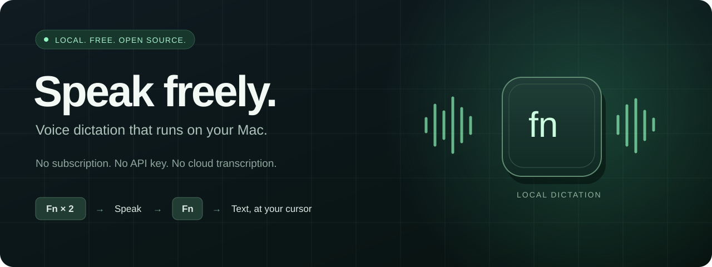
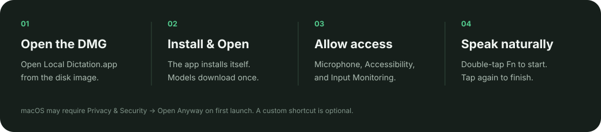
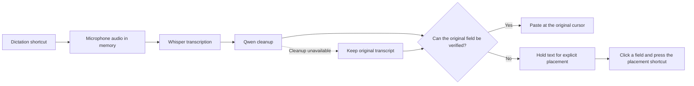

<p align="center">
  
</p>

<h1 align="center">I'm not paying for Wispr Flow.</h1>
<p align="center"><strong>Local voice dictation for your Mac. Free to use. Yours to build on.</strong></p>
<p align="center">
  <a href="https://github.com/ysham123/imnotpayingforwisprflow/releases/latest"></a>
  
  
  <a href="LICENSE"></a>
</p>
<p align="center">
  <a href="https://github.com/ysham123/imnotpayingforwisprflow/releases/latest/download/Local-Dictation.dmg"><strong>↓ Download for Mac</strong></a>
  &nbsp;·&nbsp; <a href="#get-started">Get started</a>
  &nbsp;·&nbsp; <a href="#what-runs-under-the-hood">How it works</a>
  &nbsp;·&nbsp; <a href="docs/DEVELOPMENT.md">Build from source</a>
</p>

**Click a text box. Double-tap Fn / Globe. Speak. Tap Fn once to finish.**

Fn / Globe is the default. You can choose a custom keyboard shortcut in **Settings… → Dictation shortcut → Change…**.

Local Dictation is a native menu-bar app that turns speech into text, removes fillers and accidental repetition, and resolves clear spoken corrections before inserting the result. Speech recognition and cleanup run on your Mac. The app downloads its models on first use and reuses them through updates.

No subscription, API key, account, or separate Ollama installation is required. No recordings or transcript history are saved.

```text
You say:  “Let's meet on Thursday, sorry, Friday at three.”
You get:  “Let's meet on Friday at three.”
```

That example passes the local model checks. Ambiguous speech, names, and numbers can still need editing.

## Get started

### 1. Install

[**Download Local-Dictation.dmg**](https://github.com/ysham123/imnotpayingforwisprflow/releases/latest/download/Local-Dictation.dmg), open it, and open **Local Dictation.app** inside. Choose **Install & Open**. No Terminal or developer tools are needed.

The app installs into **Applications** (`/Applications`) when your account can write there; otherwise it uses your personal **Applications** folder (`~/Applications`). An existing installation is updated in its current location. Quit the old copy before updating. If that location is not writable, the installer explains how to replace it in Finder.

On first launch, Settings shows progress while downloading about **3.4 GB** of models. You can pause and resume the download. Downloads use HTTPS and pinned SHA-256 checksums; incomplete or corrupted files are never loaded. Keep **8 GB free** for model download and recovery. Dictation runs offline after setup.

<p align="center">
  
</p>

| Requirement | Supported release |
|---|---|
| Mac | Apple Silicon, M1 or newer |
| macOS | 14 Sonoma or newer |
| Language | English |
| Memory | Tested with 16 GB; 16 GB recommended |
| Network | Needed to download; dictation runs locally afterward |
| Developer tools | None needed |

> **Community release:** the app is ad-hoc signed and is not notarized by Apple. macOS may block the first launch. After trying to open it, use **System Settings → Privacy & Security → Open Anyway** if you trust this release, then confirm Open. Follow [Apple's opening guidance](https://support.apple.com/guide/mac-help/open-a-mac-app-from-an-unknown-developer-mh40616/mac). Installation preserves macOS quarantine and does not disable Gatekeeper. This is a short native setup flow, not literally a single click.

<details>
<summary>Updating from v1.2, model storage, and offline use</summary>

The installer verifies and migrates compatible models from the existing app before replacing it. Saved shortcuts and custom words remain local and survive updates. Replacement stages and verifies the new copy first, retains a rollback copy until final verification, and refuses to replace a running app.

Models are stored outside the signed app at `~/Library/Application Support/Local Dictation/Models`. Future app updates reuse unchanged, verified weights. The bundled runtime stays in the app, so no separate Ollama installation is required. For an offline Mac, complete setup on that Mac while connected first. The [v1.2 offline installer](https://github.com/ysham123/imnotpayingforwisprflow/releases/tag/v1.2.0) remains available for its historical release.

Free ad-hoc updates change the app's code identity, so macOS may require permission approval again after an update. The installer never re-signs the app. An unchanged quit/reopen should retain permissions; see troubleshooting if it does not. We have not validated self-signed publisher certificates as a reliable replacement for Developer ID privacy permissions on recipient Macs.

</details>

### 2. Grant three permissions

The installed app opens **Settings** when setup is needed. Choose **Continue setup** for guided permission requests, or use each permission's direct button. You can reopen **Settings…** from the microphone menu at any time.

| Permission | Why it is needed |
|---|---|
| **Microphone** | Capture audio while you dictate |
| **Accessibility** | Identify your text field and insert the result |
| **Input Monitoring** | Recognize Fn / Globe and detect physical input changes across apps |

Enable **Local Dictation itself** in each permission list. If macOS asks you to quit and reopen it, do so.

The permission status updates live. Once ready, the app stays in the menu bar. Closing Settings leaves dictation running. There is no Screen Recording permission requirement.

### 3. Choose your dictation shortcut

To keep the default **Fn / Globe** gesture, free up that key in **System Settings → Keyboard**:

- Set **Press 🌐 key to** to **Do Nothing**.
- Make sure Apple's built-in Dictation shortcut does not use Fn / Globe.
- Quit other dictation apps using that key, including Wispr Flow.

Local Dictation does not change these settings automatically.

For a custom shortcut, open **Settings… → Dictation shortcut → Change…**, then press your preferred combination. Use **Command**, **Control**, or **Option** plus a key; **Shift** can be added. **F1–F20** also work without modifiers or with Shift alone. Other bare keys, Shift-only combinations, and reserved shortcuts such as Command-C, Command-V, and Command-Tab are rejected. Press Escape or switch to another app to cancel the change.

Choose a combination you do not use in other apps. A failed or canceled change leaves your saved choice unchanged. The dictation shortcut pauses while the chooser is open; close it to resume. If the previous shortcut has become unavailable, Settings reports the conflict. Conflict detection cannot identify every shortcut used inside individual apps. The choice is saved locally and restored when you reopen Local Dictation. Choose **Use Fn / Globe** to reset it.

### 4. Dictate

With the default Fn / Globe gesture:

1. Wait until the microphone menu says **Ready**, then click the text box where you want your words. Models can take a moment to load on first use.
2. **Double-tap Fn / Globe** to start. A compact floating pill shows **Listening** and microphone activity. Settings gets out of the way when you begin.
3. Speak naturally, including corrections such as “Thursday, sorry, Friday.”
4. **Tap Fn once** to finish. Wait for transcription and cleanup, then check the text.

With a custom shortcut, **press it once to start and once to finish**. The menu, Settings, and floating indicator show the selected shortcut. Fn / Globe dictation gestures are inactive until you reset to **Use Fn / Globe**.

If you click away or move the cursor, the indicator shows **Text ready**. Click the intended text box and use your selected shortcut: **tap Fn once** with the default gesture, or **press your custom shortcut once**. With Fn / Globe, a short pause distinguishes this single tap from a double-tap. You can also choose **Copy** or **Discard**. Resolve waiting text before starting another dictation; it is protected from being overwritten by a new recording.

<p align="center">
  
</p>

Completion feedback disappears quickly, or immediately when you click elsewhere. Clipboard cleanup continues in the background without reopening the pill. Only unsent text that still needs placement remains visible.

**Paste sent** means the app sent one paste but could not confirm the editor's update. Check the field before using **Copy last result**. It never automatically pastes the same result twice.

With Fn / Globe, double-tapping to finish also stops once. Use short taps rather than holding the key. The app never presses Return or sends a message for you.

### 5. Save your custom words

Choose **Custom Words…** from Settings or the microphone menu. Add a **Preferred spelling** and, optionally, **Sometimes recognized as**. For example:

| Preferred spelling | Sometimes recognized as |
|---|---|
| Wispr Flow | Whisper Flow |
| NeurIPS | NeuroIPS |

Use **Add**, **Edit**, or **Remove** to maintain one shared list. Add aliases only for repeated recognition mistakes: an ordinary word can be ambiguous. Changes apply to the next recording and never rewrite text already waiting for placement.

Whisper receives preferred spellings as recognition hints. Qwen receives matching saved forms as structured cleanup data; spelling changes still pass checks for numbers, order, and negation. These are hints and permitted edits, not model retraining or guaranteed recognition. Ambiguous corrections can stay unchanged.

The list supports up to 100 short entries. Recognition hints have a **200-token** budget, preserving complete entries in saved order. After a dictation, entries outside that budget are marked **Cleanup only**. They can still help fix a matching saved alias. Words, aliases, and your shortcut are saved only on this Mac and survive restarts and updates.

## What runs under the hood



| Component | Job |
|---|---|
| **Swift + AppKit** | Native installer, menu-bar app, floating indicator, Settings, and placement recovery |
| **AVFoundation** | Capture microphone audio and convert it to 16 kHz mono in memory |
| **whisper.cpp 1.8.3** | Run speech recognition locally with Metal acceleration |
| **Whisper large-v3-turbo, Q8_0** | English speech-to-text model, about 874 MB; receives bounded custom-word hints |
| **Ollama 0.9.6** | Bundled local correction runtime on loopback port `11437` |
| **Qwen3 4B, Q4_K_M** | Clean fillers, repetition, false starts, explicit self-corrections, and authorized spelling edits; about 2.5 GB |
| **macOS Accessibility + clipboard** | Check the destination and deliver text while preserving clipboard contents where possible |

Cleanup is conservative. Validation rejects reordered content, reassigned numbers, unfamiliar identifiers, and dropped or moved negation. If correction fails, times out, or changes too much, the app uses the original transcript. These checks reduce errors; they cannot prove that every sentence preserves its intended meaning.

## Privacy and control

- **Audio stays in memory.** Normal dictation does not write recording files.
- **No transcript history.** One waiting result is protected until you insert, copy, or discard it. A copy backup of the last dispatched result remains until replaced or the app exits. Starting or canceling another recording does not erase that backup.
- **Local inference.** Audio and text are processed by local models on your Mac; there is no cloud transcription fallback.
- **Setup downloads.** First-use model downloads contact Hugging Face and Ollama's registry for pinned model files. They receive no dictated audio, transcript, or custom-word list. Models are verified locally before loading.
- **Saved words stay local.** Custom words are stored in the app's local preferences. They are not automatically learned from other apps.
- **Temporary clipboard use.** Auto-paste stages the result and restores the previous clipboard if nothing else has copied in the meantime. Some applications' promised/lazy clipboard formats may not restore exactly.
- **Local performance measurements.** The last 100 session timings stay in memory. Export them explicitly from the microphone menu; they contain no audio, transcript, or application names.
- **Local permission diagnostics.** A bounded readiness log contains app path/signature metadata and permission/listener states. It excludes recorded audio, transcripts, typed keys, target-app names, and custom words. Export it explicitly if you need help; the installation path can contain your macOS username.
- **Your destination still matters.** Once text is inserted into another app, that app's own storage and privacy behavior applies.

The menu includes **Cancel dictation**, **Copy last result**, **Discard waiting text**, **Retry local engines**, **Retry shortcut listener**, and explicit diagnostic exports. Copy last result intentionally replaces the clipboard.

## Compatibility and troubleshooting

| What you see | What to do |
|---|---|
| Fn does nothing | Open Settings, check the exact status, and remove competing Fn shortcuts. If permissions are allowed but the listener failed, choose **Retry shortcut listener**. |
| Fn does nothing on an external keyboard | Try the Mac's built-in Fn / Globe key. Some third-party keyboards handle Fn internally and do not send an event macOS can detect. |
| Custom shortcut is rejected or already registered | Choose another combination, or close the chooser to resume your saved shortcut. If that shortcut is unavailable, choose another or reset with **Settings… → Use Fn / Globe**. |
| Custom shortcut also triggers an action in another app | Choose an unused combination. Registration conflict checks cannot detect every app-specific shortcut. |
| A function-key shortcut changes brightness, volume, or another media control | Configure your keyboard to send the corresponding F-key event rather than a media action. |
| Permissions need renewal after an update | Quit the app and approve the current installed copy in Privacy & Security. Ad-hoc updates can invalidate old grants; a stale entry may need removal and re-addition after that update. |
| Permissions are lost after an unchanged relaunch | Check that only the installed copy is running. Export permission diagnostics and report it; repeated removal/re-addition should not be the normal launch workflow. |
| All permissions are allowed, but the listener cannot start | Choose **Retry shortcut listener**. A shortcut conflict, event-tap failure, and run-loop failure have separate messages. |
| Text ready | Click the intended text box and use your selected shortcut once. If the field cannot be verified, choose **Copy** and paste manually. |
| The cursor or text field changed | Your text waits. Select its destination and use the placement shortcut, or copy/discard it. |
| “Paste sent” | Check the field before pasting again. The app could not confirm the result and does not retry automatically. |
| Correction is unavailable | Dictation can use the raw transcript. Use **Retry local engines** to retry correction startup. |
| Microphone changed or recording stopped | Captured speech is retained when possible and processed; the status explains the interruption. |
| Model download is interrupted | Reopen Settings and choose **Resume model setup**. Verified files are reused and partial downloads can resume. |
| Another copy is already running | Quit the existing copy before updating. For normal use, open the installed app in Applications. |
| A custom word is not used | Check its preferred spelling and saved alias. Recognition hints have limited space; **Cleanup only** applies after a matching alias is recognized. |
| Signature verification reports “resource fork” or Finder metadata | Install into the default local Applications folder. iCloud or other synced destinations can add metadata that invalidates the bundle. |

The creator confirmed v1.3 dictation in Chrome in normal and full-screen mode, including listening-pill visibility and completion dismissal after three unchanged app restarts. Earlier version 1.1.1 was manually checked in Claude and ChatGPT desktop text boxes. The current source also passes insertion checks across native AppKit, WKWebView, and Electron fixtures, including rich editors, delayed clipboard reads, and protected controls. Compatibility varies by app and editor; see the [validation record](docs/VALIDATION.md) for tested versions and limits. Opaque fields keep text waiting; Copy remains available when explicit placement cannot verify them. Terminal panes are not validated, and multiline terminal paste can execute commands depending on terminal settings.

Rich editors can update their accessibility text after the paste has already appeared. The app observes the original editor for up to 2.5 seconds and keeps the staged clipboard available during that window. If it still cannot confirm insertion, it reports **Paste sent** and keeps **Copy last result** available. An unchanged accessibility value does not prove that paste failed; check the visible field before inserting the result again. A new recording can begin after paste dispatch while this clipboard cleanup finishes; any subsequent paste waits for the previous transaction.

Current limits:

- English recognition; no language selector in this release.
- Dictation stops automatically after about **115 seconds**.
- Cleanup supports up to **1,500 characters** per request; longer text uses the original transcript.
- Password and read-only fields do not receive automatic insertion.
- Ad-hoc app updates may require permission approval again.
- No Intel Mac, Windows, or Linux binary.

On an M2 Pro with 16 GB RAM, the v1.3 benchmark build processed a 2.67-second synthetic dictation with custom words in a **1.39-second warm median** (1.46-second p95 across 20 runs). A 32.46-second clip took a 5.37-second median (5.68-second p95 across 10 runs). These pre-release measurements include recognition and cleanup, excluding microphone startup, model warming, and text delivery; the final name-retention guard was checked separately for correctness. Custom words improved short-clip spelling, but two speech fixtures still missed a saved term. See the [paired measurements and spelling limits](docs/VALIDATION.md#v13-warm-processing-measurements). Models stay warm during ordinary use and are released when idle under memory pressure or on sleep; loading them again takes longer.

## Build, test, contribute

The [development guide](docs/DEVELOPMENT.md) covers the Swift package, native worker, models, and regression scripts. App binaries live in **Releases**, and model weights download from pinned upstream URLs; weights never enter Git history. A fresh clone needs the downloaded runtime before it can package a runnable app.

Bug reports are welcome in [Issues](https://github.com/ysham123/imnotpayingforwisprflow/issues). Include your macOS version, chip, target app, exact menu status, and reproduction steps. Use synthetic text and redact private information.

## License and acknowledgments

Original application code is licensed under **[MIT](LICENSE)**. Bundled components and weights retain their upstream licenses: Whisper/whisper.cpp and Ollama use MIT; Qwen3 uses Apache 2.0. The release includes their notices and the exact-version licenses for dependencies inside the bundled runtime. See [third-party notices](THIRD_PARTY_NOTICES.txt) and [license inventory](Licenses/ThirdParty/Ollama/inventory.json).

Built on [whisper.cpp](https://github.com/ggml-org/whisper.cpp), [Whisper](https://github.com/openai/whisper), [Ollama](https://github.com/ollama/ollama), and [Qwen3](https://github.com/QwenLM/Qwen3).

An independent project by [Yosef Shammout](https://github.com/ysham123). Not affiliated with Wispr Flow.
